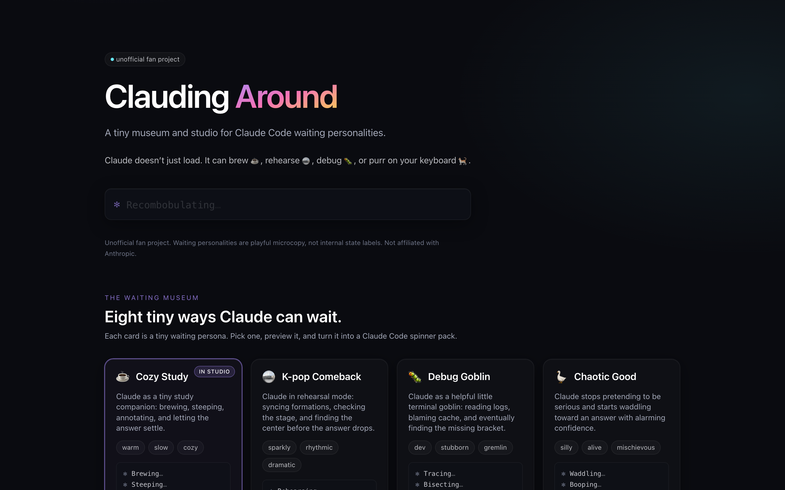
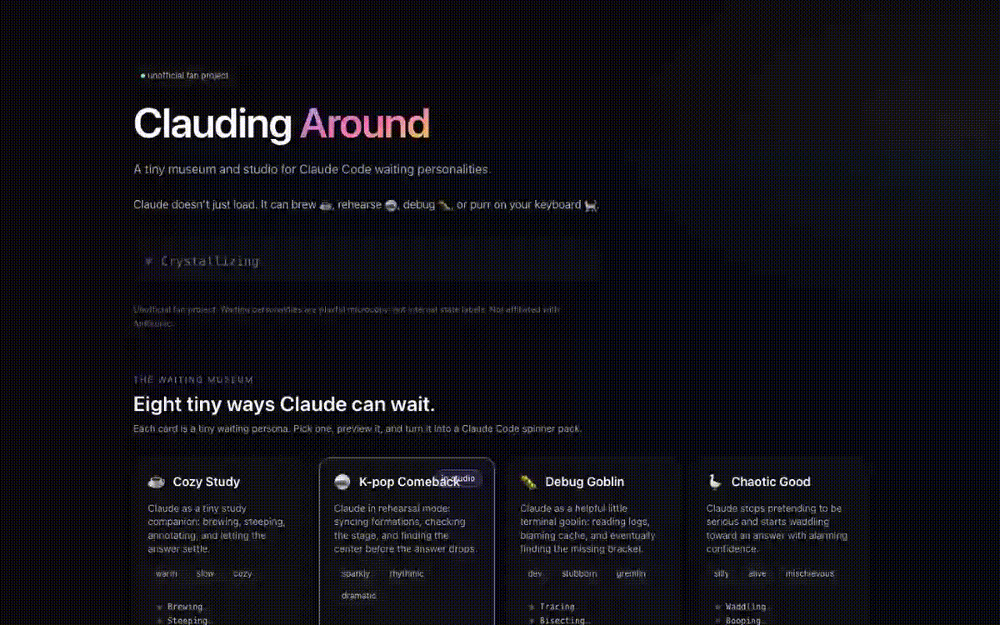

# Clauding Around

**A tiny museum and spinner pack studio for Claude Code waiting personalities.**

Claude doesn't just load. It can brew ☕, rehearse 🪩, debug 🐛, or purr on your
keyboard 🐈.

[**Live demo →**](https://kelu-look.github.io/clauding-around/)
· [GitHub repo](https://github.com/kelu-look/clauding-around)
· [K-pop Comeback demo](https://kelu-look.github.io/clauding-around/#k-pop-comeback/emoji/append)
· [Cat on Keyboard demo](https://kelu-look.github.io/clauding-around/#cat-on-keyboard/kaomoji/append)

> Unofficial fan project. Not affiliated with Anthropic. The waiting
> personalities are playful microcopy — they do **not** reveal Claude's real
> internal states. No Anthropic branding is used.

## Preview

<!--
  Drop a screenshot at docs/preview.png and a GIF at docs/demo.gif,
  then uncomment the lines below. Capture instructions: docs/README.md.

  

  
-->

_Screenshots and GIF coming soon — see [`docs/README.md`](docs/README.md) for
how to record and where to put them._

## What it does

- Browse **8 playful waiting personalities** in the Waiting Museum.
- Preview **Classic / Emoji / Kaomoji** styles side-by-side.
- Copy a valid Claude Code **`spinnerVerbs`** config to your clipboard.
- Share **direct links** to specific packs (`#personality/style/mode`).
- Ships as a **static Vite app on GitHub Pages** — no backend, no auth.

## Featured packs

Each link opens the demo with that pack pre-selected.

- ☕ [Cozy Study](https://kelu-look.github.io/clauding-around/#cozy-study/classic/append)
- 🪩 [K-pop Comeback](https://kelu-look.github.io/clauding-around/#k-pop-comeback/emoji/append)
- 🐛 [Debug Goblin](https://kelu-look.github.io/clauding-around/#debug-goblin/classic/append)
- 🪿 [Chaotic Good](https://kelu-look.github.io/clauding-around/#chaotic-good/emoji/append)
- 🌌 [Cosmic Mode](https://kelu-look.github.io/clauding-around/#cosmic-mode/classic/append)
- 🔬 [Research Mode](https://kelu-look.github.io/clauding-around/#research-mode/classic/append)
- 🌙 [Quiet Poetry](https://kelu-look.github.io/clauding-around/#quiet-poetry/classic/append)
- 🐈 [Cat on Keyboard](https://kelu-look.github.io/clauding-around/#cat-on-keyboard/kaomoji/append)

## How to use the generated config

1. Open the [live demo](https://kelu-look.github.io/clauding-around/).
2. Pick a pack from the Waiting Museum (or use a share link above).
3. In the Studio, choose **Classic**, **Emoji**, or **Kaomoji**.
4. Choose a config mode:
   - **`append`** — keep Claude Code's default spinner verbs and add this pack's verbs alongside them.
   - **`replace`** — use only this pack's verbs.
5. Click **Copy JSON**.
6. Paste the snippet into your Claude Code settings.

> Emoji and kaomoji styles are marked **experimental** in the UI. Terminal
> rendering varies widely by font and emoji-presentation engine — some glyphs
> may look off in your terminal even though they look fine in the preview.
> Switch back to **Classic** if anything renders oddly.

## Share-link format

```
#<personalityId>/<style>/<mode>
```

- `personalityId` ∈ `cozy-study`, `k-pop-comeback`, `debug-goblin`,
  `chaotic-good`, `cosmic-mode`, `research-mode`, `quiet-poetry`,
  `cat-on-keyboard`.
- `style` ∈ `classic`, `emoji`, `kaomoji`.
- `mode` ∈ `append`, `replace`.

Legacy aliases that still work: `kpop-comeback`, `k-pop`, `kpop` → `k-pop-comeback`.
Invalid ids fall back to full defaults rather than silently rewriting only the id.

## Run locally

Requires Node 18.18+ (Node 20+ recommended).

```bash
npm install
npm run dev
```

Then open the printed local URL.

## Build

```bash
npm run build     # type-check + bundle into dist/
npm run preview   # serve the built bundle
```

## Deploy

`vite.config.ts` uses `base: './'`, so the built `dist/` works on any subpath.

- **GitHub Pages.** This repo deploys via `.github/workflows/deploy.yml` on
  every push to `main`. In **Settings → Pages**, the Source must be set to
  **GitHub Actions**.
- **Vercel.** Import the repo; framework preset = **Vite**; build command
  `npm run build`; output directory `dist`.

## Recording a GIF for the README

Short version (macOS):

```bash
brew install gifski
# record with Cmd-Shift-5 → Record Selected Portion
gifski input.mov -o docs/demo.gif --fps 12 --width 1200
```

Suggested ≤ 8s flow:

1. Open the live demo.
2. Click **K-pop Comeback**.
3. Toggle to **Emoji**.
4. **Copy JSON**.
5. Click **Cat on Keyboard**.
6. Toggle to **Kaomoji**.
7. **Copy share link**.

Full instructions and an alternate (Kap / CleanShot) workflow live in
[`docs/README.md`](docs/README.md).

## Accessibility

- Real `<button>` / radio-group semantics.
- Visible focus rings.
- Full `prefers-reduced-motion` support — spinner rotation slows down and
  decorative animations stop.

## Tech

React 18 · TypeScript · Vite 5 · Tailwind CSS 3 · No backend, no auth, no database.
